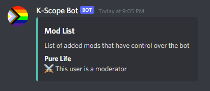

# K-Scope Bot

## Role selection and reminders bot for the Kaelaidescope Club at Kalamazoo

## default prefix is `?`
---
## Commands
### Reminders
- **?reminder** `<channel> <repeat> <now> <duration>[s/m/h/d/w] <message>`
    This will create a reminder in a specific channel with a specified interval
    - _channel_: the Text Channel to send the reminder (should be mentioned using `#`)
    - _repeat_ `true/false`: whether to repeat the reminder after the first occurrence
    - _now_ `true/false`: whether send a reminder now in addition to after the duration
    - _duration_ `number[s/m/h/d/w]`: how long until the reminder (does not support mixing times)
    - _message_: the message to send to `channel` after `duration`
    - ex:
        ```
        ?reminder #general true true 1w @everyone remember to go to the meeting!
        ```
        - This will send `@everyone remember to go to the meeting!` to `#general` every `1w`. It will also send that reminder immediately to `#general`.

- **?reminderdelete** `<reminder-id>`
    This will delete a reminder with a specified reminder-id
    - _reminder-id_: the 5-digit id of the reminder you'd like to delete
    -ex:
        ```
        ?reminderdelete 12345
        ```
        - This will delete the remind with the id of `12345`

- **?reminders**
    Lists the currently active reminders
---
### Role Select
- **?roleselect** `<channel> <title> <description> <*roles>`
    Lets you send a message to a specified channel that lets user gain roles by choosing reactions
    - _channel_: the Text Channel to send the role select message to (should be mentioned using `#`)
    - _title_: the title for the role select (multi-word titles should be enclosed by double quotes `""`)
    - _description_: the description for the role select (multi-word descriptions should be enclosed by double quotes `""`)
    - _*roles_: all of the roles you want to be assignable (multi-word roles should be enclosed by double quotes `""`)
    - ex:
        ```
        ?roleselect #welcome "Role Select" "This is an example role select" one two three four "five six"
        ```
        - This will create a role select like the following in `#welcome`:
        
        - Notice how we used double quotes (`""`) to make `five six` a single role
---
### Settings
All of these commands should be prefaced with `?settings`
#### Mods
- **?settings addmod** `<user>`
    Adds a user to the bot's moderator list
    - _user_: a mentioned user to add to the bot's moderator list
    ex:
        ```
        ?settings addmod @test-account
        ```
        - This would add the user `@test-account` as a moderator for the bot
- **?settings removemod** `<user>`
    Removes a user from the bot's moderator list
    - _user_: a mentioned user to remove from the bot's moderator list
    ex:
        ```
        ?settings removemod @test-account
        ```
        - This would remove the user `@test-account` as a moderator for the bot
- **?settings mods**
    Lists the bot's moderator list
    ex:
        ```
        ?settings mods
        ```
        - This will display a message like the following:
        
#### Misc.
- **?settings prefix** `<prefix>`
    Lets you change the prefix of the bot
    - _prefix_: whatever you want to change the prefix
    ex:
        ```
        ?settings prefix !
        ```
        - This will set the bot's prefix to `!`
