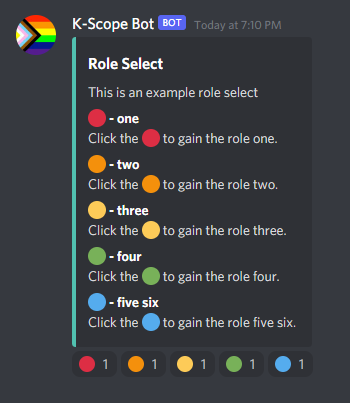

# K-Scope Bot

## Role selection and reminders bot for the Kaelaidescope Club at Kalamazoo

## default prefix is `?`

## Commands
### Reminders
- ?reminder `<channel> <repeat> <now> <duration>[s/m/h/d/w] <message>`
    - channel: the Text Channel to send the reminder (should be mentioned using `#`)
    - repeat `true/false`: whether to repeat the reminder after the first occurrence
    - now `true/false`: whether send a reminder now in addition to after the duration
    - duration `number[s/m/h/d/w]`: how long until the reminder (does not support mixing times)
    - message: the message to send to `channel` after `duration`
    - ex:
        ```
        ?reminder #general true true 1w @everyone remember to go to the meeting!
        ```
        - This will send `@everyone remember to go to the meeting!` to `#general` every `1w`. It will also send that reminder immediately to `#general`.
<br>
- ?reminderdelete `<reminder_id>`
    - reminder_id: the 5-digit id of the reminder you'd like to delete
    -ex:
        ```
        ?reminderdelete 12345
        ```
        - This will delete the remind with the id of `12345`
<br>
- ?reminders
    - Lists the currently active reminders
<br>
### Role Select
- ?roleselect `<channel> <title> <description> <*roles>`
    - channel: the Text Channel to send the role select message to (should be mentioned using `#`)
    - title: the title for the role select (multi-word titles should be enclosed by double quotes `""`)
    - description: the description for the role select (multi-word descriptions should be enclosed by double quotes `""`)
    - *roles: all of the roles you want to be assignable (multi-word roles should be enclosed by double quotes `""`)
    - ex:
        ```
        ?roleselect #welcome "Role Select" "This is an example role select" one two three four "five six"
        ```
        - This will create a role select like the following in `#welcome`:
        
        - Notice how we used double quotes (`""`) to make `five six` a single role
